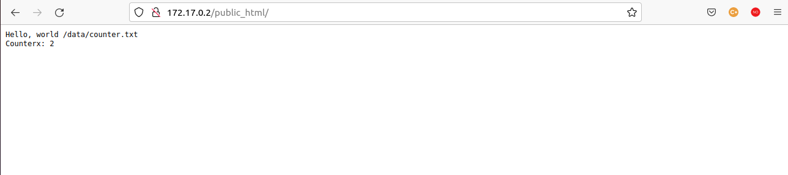
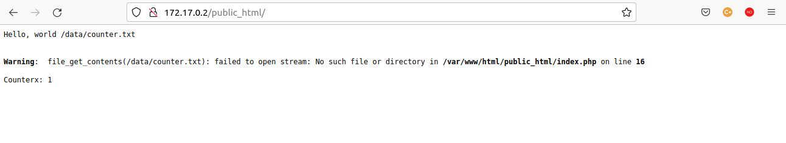

# myFirstDocker-SI

Mi primera app dockerizada con @AndreuSorell
Es una simple aplicación que usa php y el servidor web Apache.

<hr>

Como se puede observar, en la carpeta primer-docker tenemos un fichero que nos va a permitir crear nuestra aplicación a partir de contenedores que usen las imagenes de el software que vamos a usar. Se trata del Dockerfile.

Después de hacer toda la instalacion de docker y la comprobación de que funciona correctamente, podemos ver que contamos con una serie de scripts en bash para lanzar los comandos de docker de forma automática y poder de esta manera manipular el contenedor que este ejecutando la aplicación.

Por tanto, vamos a proceder a la creación de la imagen

la opción -t nos permite establecer el nombre de la imagen

``` bash
docker build -t firstdocker

Sending build context to Docker daemon  15.36kB
Step 1/9 : FROM debian
 ---> 04fbdaf87a6a
Step 2/9 : ENV TZ=Europe/Madrid
 ---> Using cache
 ---> 1c93a53cbc5e
Step 3/9 : RUN apt-get update -qq >/dev/null && apt-get install -y -qq procps telnet apache2 php7.4 -qq >/dev/null
 ---> Using cache
 ---> 6050fbd03ed7
Step 4/9 : WORKDIR /var/www/html
 ---> Using cache
 ---> d45124f53987
Step 5/9 : COPY . /var/www/html/
 ---> Using cache
 ---> 5eea4b39164a
Step 6/9 : RUN mkdir /data && chown -R www-data /data && chmod 755 /data & chmod 775 -R /var/www/html/
 ---> Using cache
 ---> 4b5854cfeef8
Step 7/9 : COPY php.conf /etc/apache2/mods-available/php7.3.conf
 ---> Using cache
 ---> dce26fb39f95
Step 8/9 : RUN a2enmod php7.4
 ---> Using cache
 ---> 94efd8fc8e1a
Step 9/9 : CMD  ["./entrypoint.sh"]
 ---> Using cache
 ---> 67795921405b
Successfully built 67795921405b
Successfully tagged firstdocker:latest
```

Acabamos de crear la imagen en local con nombre <i>firstdocker</i> y vamos a comprobarlo

``` bash
docker images
REPOSITORY    TAG       IMAGE ID       CREATED         SIZE
firstdocker   latest    02bcd55a5bae   2 minutes ago   272MB
debian        latest    04fbdaf87a6a   3 weeks ago     124MB
```
Ya tenemos la imagen construida, ahora podemos crear y lanzar un contenedor con el script debug.sh

``` bash
bash debugh.sh

----> Point your browser at http://localhost:8086/public_html/


AH00558: apache2: Could not reliably determine the server's fully qualified domain name, using 172.17.0.2. Set the 'ServerName' directive globally to suppress this message

```


Ya tenemos acceso a la app:

</img>


Comprobamos que el contenedor está activo:


``` bash
docker ps
CONTAINER ID   IMAGE      COMMAND             CREATED          STATUS          PORTS                                   NAMES
b8ebc50b497f   chapter2   "./entrypoint.sh"   10 minutes ago   Up 10 minutes   0.0.0.0:8086->80/tcp, :::8086->80/tcp   chapter2

```

Vamos a realizar un par de pruebas con el contenedor

- restart

``` bash
joan@portatilacerjoan:~$ docker restart chapter2
chapter2
joan@portatilacerjoan:~$ docker ps
CONTAINER ID   IMAGE      COMMAND             CREATED          STATUS         PORTS                                   NAMES
b8ebc50b497f   chapter2   "./entrypoint.sh"   14 minutes ago   Up 4 seconds   0.0.0.0:8086->80/tcp, :::8086->80/tcp   chapter2

```

- stop

``` bash 
joan@portatilacerjoan:~$ docker stop chapter2
chapter2
joan@portatilacerjoan:~$ docker ps 
CONTAINER ID   IMAGE     COMMAND   CREATED   STATUS    PORTS     NAMES

```

hacemos un docker run de nuevo y comprobamos que el contador vuelve estar en 1:

</img>


